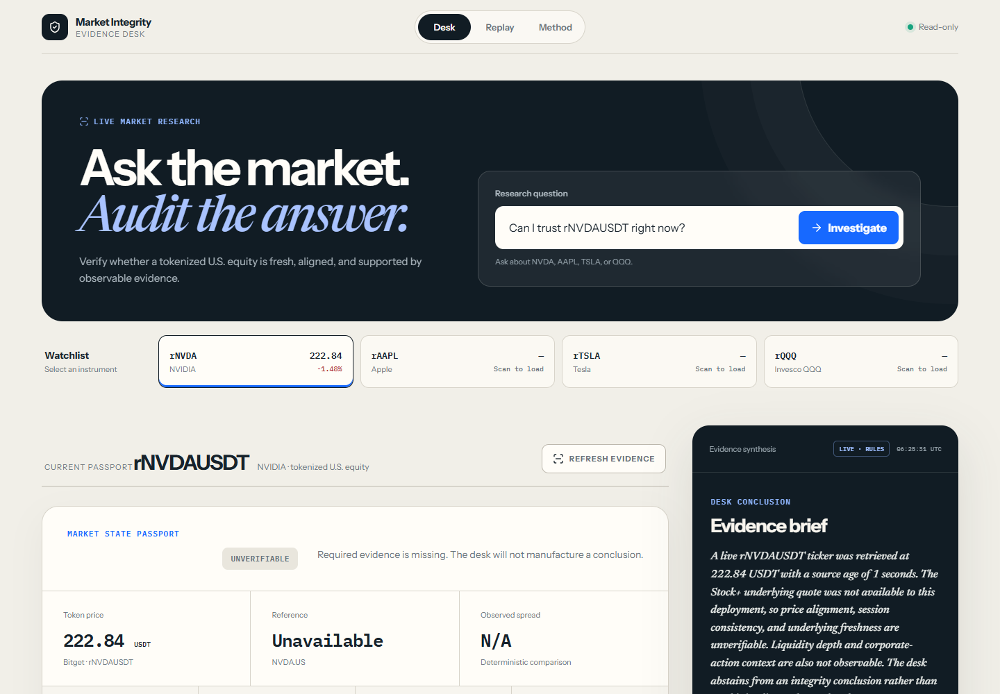

# Market Integrity Desk

A read-only, evidence-first AI Trading Desk for Bitget tokenized U.S. equities. It produces a reproducible Market State Passport rather than a trading signal.

**Live demo:** https://bitget-market-integrity-desk.vercel.app

> Can the current state of a 24/7 tokenized-equity market be supported by fresh, internally consistent evidence?



## Why it exists

A tokenized U.S. equity can trade while its underlying market is closed, stale, or reacting to information published on a different timeline. A price dashboard shows the numbers but does not tell a researcher which facts are fresh, which claims conflict with timestamps, or which questions cannot be answered with the available endpoints. Market Integrity Desk separates those responsibilities:

1. **Observe:** retrieve Bitget rToken and Stock+ values with source timestamps.
2. **Verify:** calculate premium, freshness, and session consistency in deterministic code.
3. **Investigate:** let Qwen summarize only the supplied evidence records and cite their IDs.
4. **Abstain:** expose `UNVERIFIABLE` and `NOT OBSERVABLE` instead of inventing confidence.

The target user is a research-driven, medium-frequency Bitget rToken trader who checks a small watchlist before acting and values evidence quality over directional predictions.

## What is real today

- Deterministic premium and freshness checks with published thresholds.
- Explicit `UNVERIFIABLE` and `NOT OBSERVABLE` states.
- Per-item provenance and evidence timestamps.
- Responsive Live Desk, Replay Lab, and Methodology views.
- A Vercel serverless endpoint that attempts parallel Bitget rToken and Stock+ retrieval.
- A bounded Qwen investigator endpoint that can summarize only supplied evidence IDs.
- A clearly labeled snapshot fallback when live sources cannot be reached.

## Judge walkthrough

1. Open **Live Desk** and choose `rTSLAUSDT` to show that each instrument creates a new Passport.
2. Run the integrity scan. The badge explicitly distinguishes `LIVE` from `SNAPSHOT` and `QWEN` from `RULES`.
3. Expand **Quote freshness** to audit thresholds and source ages.
4. Select an evidence item and open **Inspect provenance** to reveal its endpoint and retrieval timestamp.
5. Open **Replay Lab** to inspect frozen cases and **Methodology** to see the Observe → Verify → Investigate → Abstain boundary.

## Architecture

```text
Bitget rToken ticker ─┐
                     ├─> deterministic checks ─> Market State Passport
Bitget Stock+ quote ─┘             │                       │
                                   └─> bounded evidence ─> Qwen brief
                                                (server-side key, cited IDs only)
```

The model does not calculate premiums, decide freshness, fabricate unavailable liquidity, predict returns, or execute orders.

## Run locally

```powershell
npm.cmd install
npm.cmd run dev
```

The Vite-only local run uses the snapshot fallback because `/api/scan` is a Vercel function. Use `vercel dev` to exercise the serverless route locally, or deploy to Vercel.

Set `BITGET_QWEN_API_KEY` only in the server environment to enable the model-backed evidence brief. Without it, the UI remains fully functional and labels the deterministic fallback as `RULES`; the key is never shipped to the browser.

The public rToken ticker can run without exchange credentials. The Stock+ underlying quote is authenticated; optionally configure the read-only server variables `BITGET_ACCESS_KEY`, `BITGET_SECRET_KEY`, and `BITGET_PASSPHRASE`. If they are absent, the deployment returns a real partial-live Passport with the underlying and dependent checks marked `UNVERIFIABLE`—it never mixes the live rToken with a snapshot underlying.

## Validation

The 42-second submission film is available as an [MP4](submission/market-integrity-desk-demo.mp4), with a separate [caption file](submission/market-integrity-desk-demo.srt) and [thumbnail](submission/demo-thumbnail.png). It was rendered from the reproducible Remotion source in `video/`.

```powershell
npm.cmd test
npm.cmd run build
npm.cmd run lint
```

Current developer-observed validation:

- 8/8 deterministic and natural-language routing unit tests pass.
- Production build and lint pass.
- Desktop and 390 × 844 browser walkthroughs pass without document-level horizontal overflow.
- Natural-language instrument resolution, instrument switching, live and fallback scans, navigation, check expansion, evidence selection, and raw provenance reveal were exercised in the in-app browser.
- The submission film was verified as 1920 × 1080, 30 fps, H.264/AAC, 42.048 seconds.

These are product QA observations, not user-adoption or trading-performance claims. A frozen point-in-time benchmark is the next validation layer; no fixture result is represented as historical accuracy.

## Data policy

The application never turns an unavailable endpoint into a negative fact. In particular, missing Reality depth is shown as `NOT OBSERVABLE`, and missing corporate-action data is shown as `UNVERIFIABLE`.

## Current limitations

- The public rToken path is verified in production. The authenticated Stock+ reference path remains unverified because no read-only credential is configured.
- Replay cases are demonstration fixtures until the frozen dataset and evaluator are published.
- The model-backed path is implemented but was not exercised during local validation because no server-side Qwen credential was present.
- Research only; no order execution and no investment advice.

## Repository map

- `api/scan.js` — allowlisted, bounded live-source scan.
- `api/evidence.js` — server-only Qwen investigator with evidence-ID validation.
- `src/lib/integrity.ts` — published deterministic rules.
- `src/data/snapshots.ts` — labeled product demonstration snapshots.
- `design/fidelity-ledger.md` — concept-to-implementation comparison and intentional deviations.
- `submission/` — judge walkthrough, submission-form draft, validation record, and recording script.

## Security and data discipline

- No exchange credentials are required for the read-only market scan.
- `BITGET_QWEN_API_KEY` stays in the server environment.
- Symbols are selected from a fixed allowlist; arbitrary upstream URLs are not accepted.
- Model input size, output length, request duration, and cited evidence IDs are bounded.
- No wallet, order, balance, or private user data is collected.
